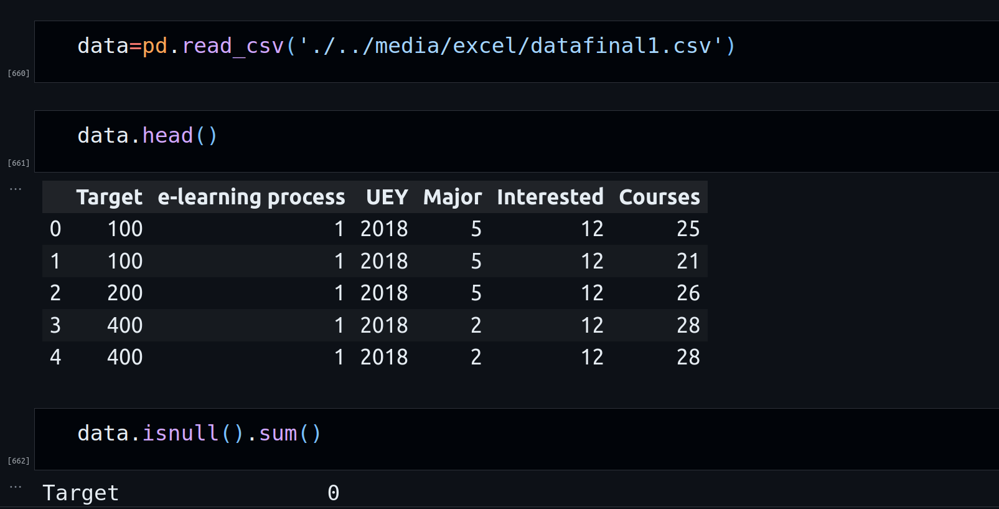

# PeerLearnAI

PeerLearnAI is a Django-based website designed to assist university students in sharing and discovering courses. The platform utilizes machine learning algorithms to suggest courses based on students' interests and previous ratings. Data from an online survey of 300 students was collected to train the machine learning model. The project includes a well-structured database schema to store course and user data.

## Installation

Follow these steps to set up the PeerLearnAI project on your local machine:

1. **Install Dependencies:**
    - Python
    - XAMPP
    - Visual Studio Code

2. **Start XAMPP:**
    - Open XAMPP and start Apache and MySQL.

3. **Database Setup:**
    - Open MySQL admin.
    - Create a new database named `atcdatabase`.
    - Import the database schema from `atcdatabase.sql` located in the Project file.
    - Create a new user (`khdev` with password `Hh123456Hh`) and grant all permissions to the `atcdatabase`.

4. **Clone Project:**
    ```bash
    cd desktop
    python3 -m venv khdev
    git clone 
    cd khdev
    ```

5. **Install Python Packages:**
    ```bash
    pip install -r requirements.txt
    ```

6. **Run Server:**
    ```bash
    python manage.py runserver
    ```
    Open your browser and navigate to the URL shown in the terminal.

## Admin and Teacher Credentials

- **Admin Login:**
    - Base URL: `/admin`
    - Username: `khdev`
    - Password: `Hh123456Hh`

- **Teacher Login:**
    - Username: `hamza`
    - Password: `Hh123456Hh`

## Contributing

If you'd like to contribute to PeerLearnAI, please follow our [contribution guidelines](CONTRIBUTING.md).

## License

This project is licensed under the [MIT License](LICENSE).

## Contact

For any inquiries or issues, please contact the project maintainers:
- Your Name <hamza.alkhatib.se@gmail.com>


## Data Cleaning

